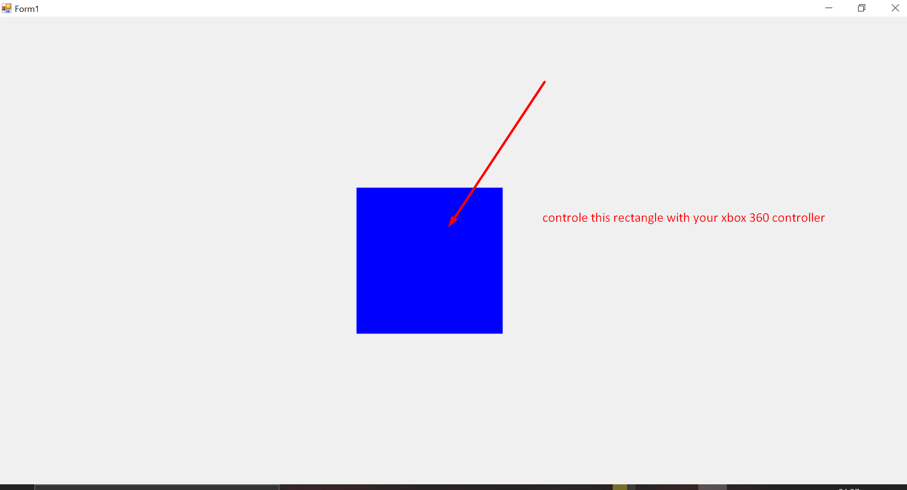

# Move a Grafical Object(Rectangle) With XBox 360 Controller C# Form
 provide to use X,Y,B,A keys to move a object

<h1>If you want to just copy paste this example</h1>

 

 Before start:

1)
 You need to add two referance:
  
 1.System.Runtime.WindowsRuntime

The Path:
C:\Program Files (x86)\Reference Assemblies\Microsoft\Framework\.NETCore\v4.5\System.Runtime.WindowsRuntime.dll

 2.Windows.Gaming:
 The Path:
 C:\Windows\System32\WinMetadata\Windows.Gaming.winmd

2)Open a Windows form application project in C# and right click on project,Unload project
doubleclick unloaded project
add:
    <TargetPlatformVersion>10.0</TargetPlatformVersion>
    10.0 for windows 10 
    for windows 8 its 8.0
    save
    rightclick unloaded project
    set reloadproject.

 
